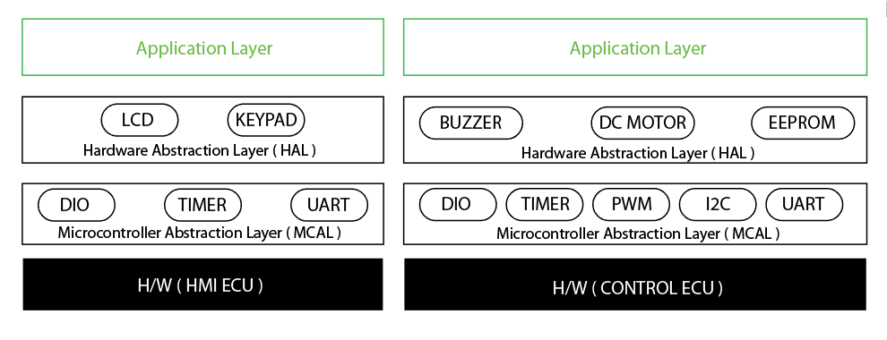
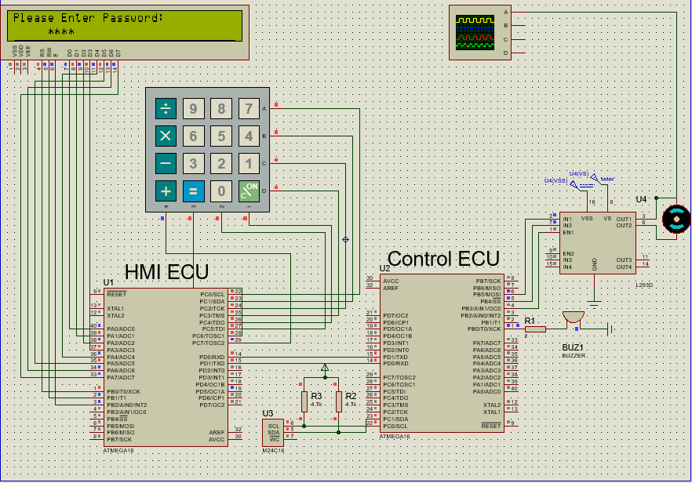

# Door Locker Security System
A system to lock and unlock a door using a password.
Drivers: GPIO, Keypad, LCD, Timer, UART, I2C, EEPROM, Buzzer and DC-Motor. Microcontroller: ATmega16.
## Layered Architecture

## the website displaying the path 

